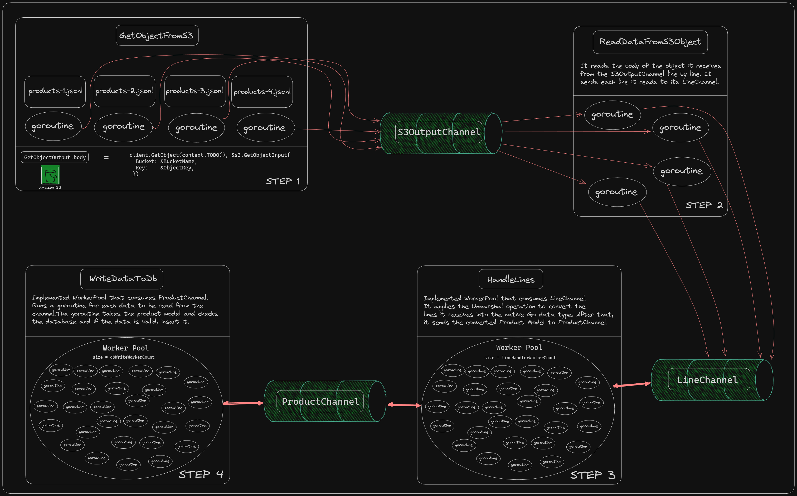

# AsyncS3ToDBLoader
#### This project has two applications.
### 1. Job
Reads Bucket names and Object keys from s3-objects.yml. It then processes these JSON files concurrently and saves them to the database at the end of the day.
1. Fetch jsonl files from the AWS S3.
2. Read files line by line and convert each line (which is a JSON object) to a Go struct.
3. Write the converted data to a database.

* After receiving the objects, it makes the necessary validations and gives it to S3OutChannel.
* The goroutine that receives the object from s3OutChannel reads the object's body line by line and sends it to LineChannel.
* There is a worker pool that will receive the sent lines. Workers unmarshal these lines from the Product model and send them to the ProductChannel.
* There is also a worker pool that receives the Product Channel. These workers save the received Product model to the database.

#### There is an option to change the sizes.
``` go
var s3OutChan chan *s3.GetObjectOutput
var lineChan chan string
var productChan chan model.Product
var lineHandlerWorkerCount int
var dbWriteWorkerCount int
```
```
- Use MongoDB as database
- Use Viper tool to read yml
- Use Aws Go SDK v2 to read files from S3
```
### 2. Microservice
RESTful API with only one GET endpoint to get a data by id from the database.
```
- Use MongoDB as database
- Use Fiber as web framework
- Use Viper to read yml
- Use Validator to validate the request
```

```http
GET /api/v1/product/:id
```

## Project Setup and Usage

### Requirements

-  Docker and Docker Compose installed on your system.
- Make installed on your system.
- AWS S3 Bucket with JSONL files. 
- You need to change the values of the environment variables in the .env file.
- s3-objects.yml file with the following format:
```yaml
S3:
  - BucketName: "bucket-name"
    ObjectKey: "object-key.jsonl"
  - BucketName: "bucket-name"
    ObjectKey: "object-key.jsonl"
```

### Make Commands:
```bash
make all # up and run the project in the background
make build # build and up the project
make down # down the project
make re # down and up the project
make clean # clean volumes and down the project
make db # build and up the mongodb in the background
make job # build and up the job
make microservice # build and up the microservice
```
Note: To make things easier, there is a command that sends a curl request to our microservice API.
Example usage is as follows:
```bash
# Send the request to this URL pattern: http://localhost:8080/api/v1/product/3
make request {PORT} {METHOD} {ID}
make request 8080 GET 3
```


## Explanatory Draw

